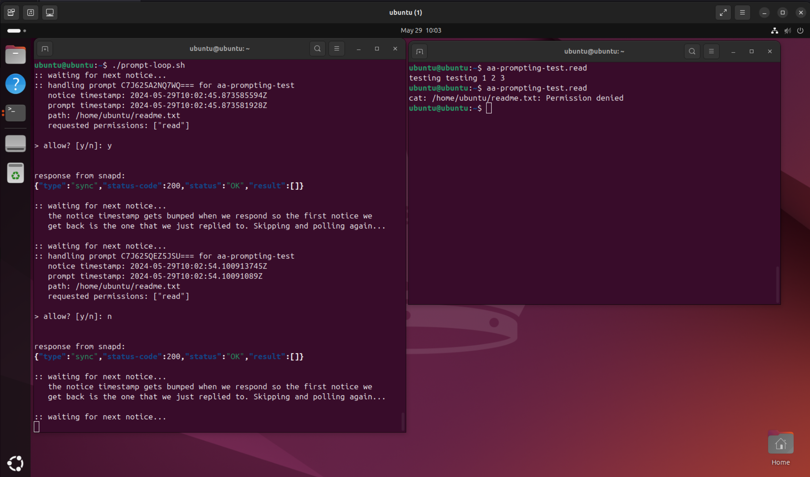

# Apparmor prompting local testing

> See [SD121][0] and [UD062][1] for specs covering the snapd and client
> implementations respectively.



## Getting set up
```bash
$ sudo apt install virt-viewer
$ sudo snap install lxd
$ sudo snap install snapcraft --classic
```

## Local testing via lxd

So long as you have `lxd` installed you will be able to quickly spin up and
bootstrap a VM for local testing against the `latest/edge/prompting` channel
of snapd.

> If you have your own preferred workflow for local development and testing
> this is not a requirement, but it does help standardise how we test changes
> on both the client and snapd sides ;)

The first time you are setting up your test VM, running the following from
your host should be sufficient to get you a local testing environment. Please
note that you will need a local rust compiler to be able to build the client.
```bash
$ make create-vm

# In a second terminal
$ make copy-vm-bootstrap
$ make update-client-in-vm
```

Then inside of the VM itself run the following to set up the VM:
```bash
$ sudo ./bootstrap-vm.sh
```


## Running the example CLI client

Inside of your prepared VM you should then be able to run the following in
order to demo the client interaction with snapd for allowing and denying
prompts:
```bash
$ ./aa-prompt-client

# In another terminal
$ aa-prompting-test.read
```

## Running the integration tests

Once you have set up an `aa-testing` VM you will be able to build and run the integration
tests from your host like so:
```bash
$ make integration-tests
```


## TODO
- [ ] Development of the actual client code


  [0]: https://docs.google.com/document/d/1tBnefdukP69EUJOlH8bgD2hrvZCYoE8-1ZlqRRYlOqc/edit
  [1]: https://docs.google.com/document/d/1zJVbo3rRc0yfNMTloE2vJGVldHLC0-PmxAyJoFn7mwE/edit
